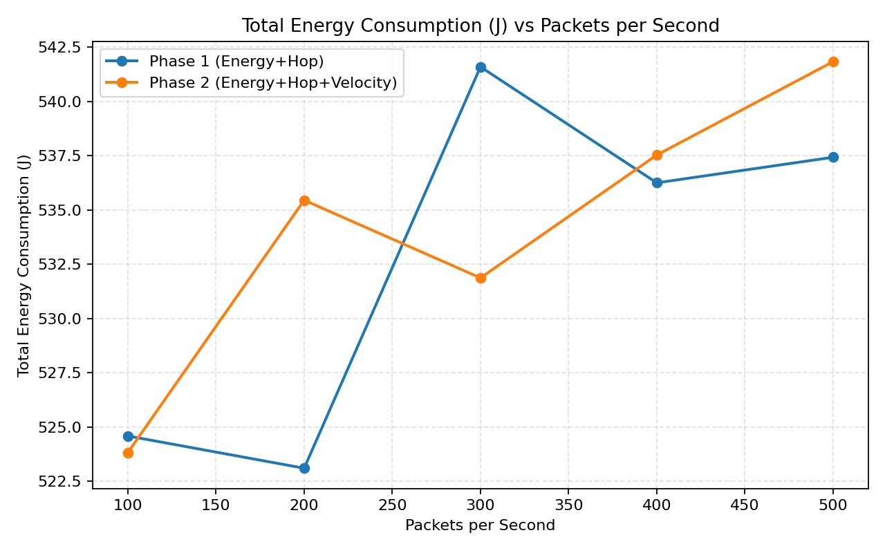

# FF-AODV Results Section (Assignment-Aligned)

## Network Topologies Under Simulation

- Topology class: wireless mobile ad-hoc FANET in ns-3.39.
- MAC/PHY used in experiments: IEEE 802.11 ad-hoc.
- Routing variants compared:
  - Phase 1: FF-AODV (energy + hop-count fitness)
  - Phase 2: FF-AODV-v2 (energy + hop-count + velocity fitness)
- Mobility model: Gauss-Markov, with speed as an explicit sweep parameter.
- Addressing model: single IPv4 ad-hoc subnet.

## Parameters Under Variation

- Number of nodes: 20, 40, 60, 80, 100
- Number of flows: 10, 20, 30, 40, 50
- Packets per second (per flow): 100, 200, 300, 400, 500
- Node speed (m/s): 5, 10, 15, 20, 25
- Protocol version: 1 (Phase 1), 2 (Phase 2)

## Modifications Made in the Simulator

- Added path fitness to AODV RREQ/RREP headers and routing table entries.
- Replaced route update decision from hop-only preference to fitness-based preference.
- Phase 2 extension:
  - Added velocity field in control packets.
  - Added velocity-aware term to fitness.
  - Path fitness uses weakest-link minimum aggregation.
  - Path velocity tracks worst-case (maximum) speed along route.
- Added duplicate-RREQ improvement logic to keep better-fitness alternatives.
- Added RREP seeding logic so discovered fitness/velocity propagates correctly.

## Results with Graphs

Generated by [run_experiments.py](run_experiments.py).

### Throughput

- 
- 
- 
- 

### End-to-End Delay

- 
- 
- 
- 

### Packet Delivery Ratio

- 
- 
- 
- 

### Packet Drop Ratio

- 
- 
- 
- 

### Energy Consumption

- 
- 
- 
- 

## Summary Findings

Expected outcome trends that should be validated using actual generated plots:

- At higher mobility (15 to 25 m/s), Phase 2 is expected to show better PDR and lower drop ratio than Phase 1.
- Delay can improve in Phase 2 under high speed because fewer unstable links are selected.
- Throughput under high mobility is expected to degrade less sharply for Phase 2 than Phase 1.
- Total energy consumption may slightly increase in Phase 2 in some settings if longer but more stable routes are selected.

## Reflection on Findings (Discussion)

- Why improvements are expected:
  - Phase 2 penalizes fast nodes, reducing route-break frequency.
  - Fewer route failures reduce packet loss and control overhead from rediscovery.
- Trade-off discussion:
  - Stability-aware routing may select non-minimum-hop paths.
  - This can increase forwarding cost but improve delivery reliability.
- Limitations:
  - The experiment script currently targets 802.11 only.
  - Assignment extension to 802.15.4 can be added with a parallel script using LR-WPAN/6LoWPAN modules.
